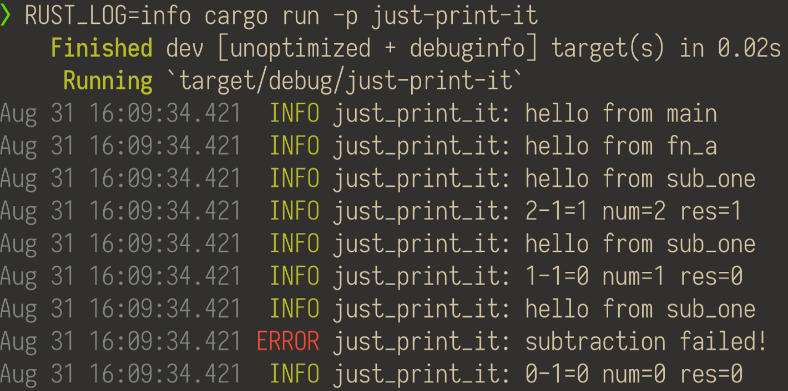
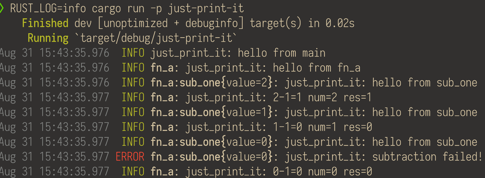

+++
title = "Tracing Introduction"
description = ""
date = 2020-08-06
draft = true

[taxonomies]
categories = ["Programming"]
tags = ["post", "rust", "tracing"]
+++

# Tracing
[Tracing](https://github.com/tokio-rs/tracing) is an instrumentation library
that makes it easy to add traceable spans to your rust code.

# Just Print It
The simplest example is to just log your tracing output, that will result in
the same as using a logging crate, like [slog](https://github.com/slog-rs/slog).

```toml
[dependencies]
tracing = "0.1"
```

```rust
use tracing::info;

fn main() {
    info!("hello world");
}
```
When we run this...
```shell
> cargo run -p just-print-it
    Finished dev [unoptimized + debuginfo] target(s) in 0.01s
    Running `target/debug/just-print-it`
```
Nothing happens.

But that's easy to solve, if we look at the tracing examples, we will realize
that we need an subscriber to receive the tracing events.

Let's add the new dependency
```toml
[dependencies]
tracing = "0.1"
tracing-subscriber = "0.2"
```

Setup the subscriber
```rust
use tracing::info;
use tracing_subscriber;

fn main() {
    tracing_subscriber::fmt::init();
    info!("hello world");
}
```

And now...
```shell
> cargo run -p just-print-it
    Finished dev [unoptimized + debuginfo] target(s) in 0.01s
    Running `target/debug/just-print-it`
```
Still nothing...

Oh, turns out we need to set the `RUST_LOG` environment variable to `info`, by
default the subscriber is printing only messages with level `error` and above.

```shell
> RUST_LOG=info cargo run -p just-print-it
    Finished dev [unoptimized + debuginfo] target(s) in 0.02s
    Running `target/debug/just-print-it`
Aug 28 16:26:39.905  INFO just_print_it: hello world
```

Lets add some functions
```rust
use tracing::{error, info};
use tracing_subscriber;

fn fn_a () {
    info!("hello from fn_a");
    for i in (0..3).rev() {
        let res = sub_one(i);
        info!(num=i, res, "{}-1={}", i, res);
    }
}

fn sub_one (value: u8) -> u8 {
    info!("hello from sub_one");
    match value.checked_sub(1) {
        Some(i) => i,
        None => {
            error!("subtraction failed!");
            0
        },
    }
}

fn main() {
    tracing_subscriber::fmt::init();
    info!("hello from main");
    fn_a();
}
```



Using `tracing::instrument`

```rust
use tracing::{error, info};
use tracing_subscriber;

#[tracing::instrument]
fn fn_a () {
    info!("hello from fn_a");
    for i in (0..3).rev() {
        let res = sub_one(i);
        info!(num=i, res, "{}-1={}", i, res);
    }
}

#[tracing::instrument]
fn sub_one (value: u8) -> u8 {
    info!("hello from sub_one");
    match value.checked_sub(1) {
        Some(i) => i,
        None => {
            error!("subtraction failed!");
            0
        },
    }
}

fn main() {
    tracing_subscriber::fmt::init();
    info!("hello from main");
    fn_a();
}
```



# Process Tracing
# Distributed Tracing
# All Togheter
